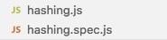

In my project we keep files and their tests next to each other.

I wanted a quick way to run tests for currently open file regardless which one
of the pair is opened. I accomplished this by adding `tasks.json` to my project.

```JSON
{
  "version": "2.0.0",
  "presentation": {
    "echo": true,
    "reveal": "always",
    "focus": false,
    "panel": "shared"
  },
  "tasks": [
    {
      "label": "Run current file tests",
      "type": "shell",
      "isBackground": true,
      "command": "npx",
      "args": [
        "jest",
        "--watch",
        "${fileDirname}/${fileBasenameNoExtension}"
      ],
      "problemMatcher": []
    }
  ]
}
```

For convenience also configured a keyboard shortcut in `keybindings.json`:

```JSON
{
    "key": "cmd+t",
    "command": "workbench.action.tasks.runTask",
    "args": "Run current file tests",
    "when": "editorTextFocus"
},
```

Now I can run the tests by pressing `CMD+T` whenever `hashing.js`
or `hashing.spec.js` is opened.